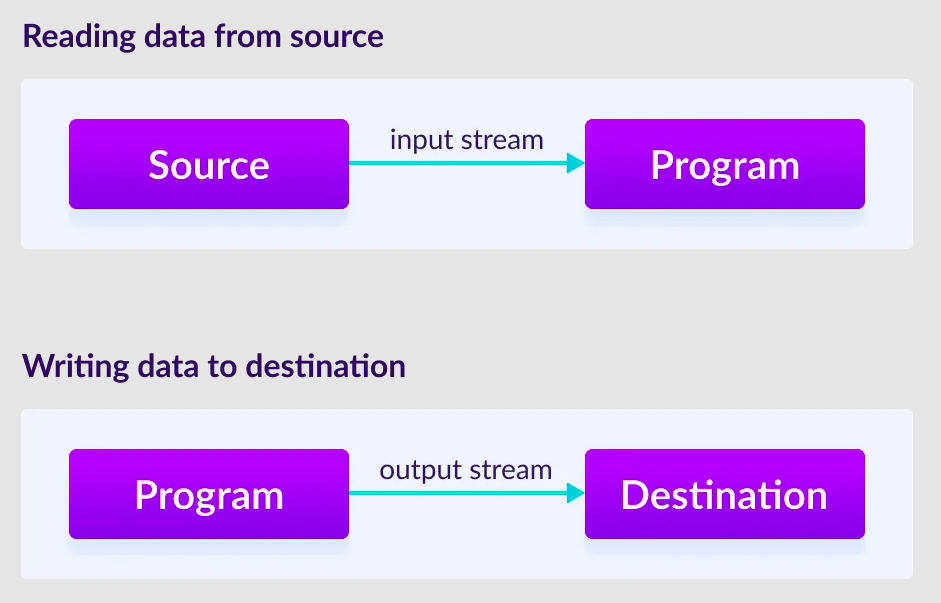
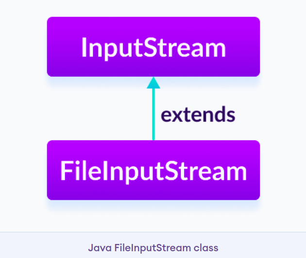
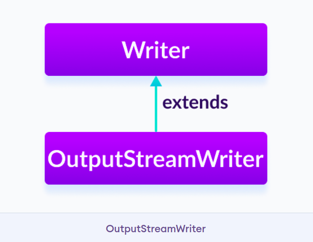
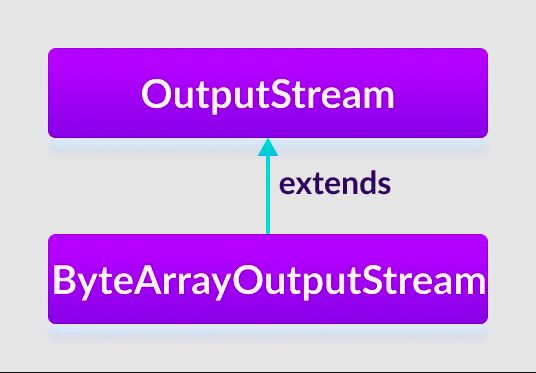

# Java I/O Stream

## Java I/O Stream

<details><summary>Java I/O Stream</summary>

- In Java, streams are the sequence of data that are read from the source and written to the destination.

- An input stream is used to read data from the source. And, an output stream is used to write data to the destination.

#### Example:
- In the above example, we have used `System.out` to print a string. Here, the `System.out` is a type of output stream.

- Similarity, there are input streams used to take input, such as `System.in` which are often combined with the `Scanner` class.



Credit: Programiz

</details>

<details><summary>Types of stream</summary>

#### Depending upon the data a stream holds, it can be classified into:
- Byte Stream
- Character Stream

</details>

<details><summary>Byte Stream</summary>

- Byte stream is used to read data and write a single byte (8 bits) of data.

- All byte stream classes are derived from base abstract classes called `InputStream` and `OutputStream`.

</details>

<details><summary>Character Stream</summary>

- Character stream is used to read and write a single character of data.

- All the character stream classes are derived from base abstract classes `Reader` and `Writer`.

</details>

## 1.1. Java InputStream Class

<details><summary>Java InputStream Class</summary>

- The `InputStream` class of the `java.io` package is an abstract superclass that represents an input stream of bytes.

- Since `InputStream` is an abstract class, it is not useful by itself. However, its subclasses can be used to read data.

</details>

<details><summary>Subclasses of InputStream</summary>

- In oder to use the functionality of `InputStream`, we can use its subclasses. Some of them are:

    - `FileInputStream`

    - `ByteArrayInputStream`

    - `ObjectInputStream`



Credit: Programiz

</details>

<details><summary>Create an InputStream</summary>

- In oder to create an InputStream, we must import the `java.io.InputStream` package first.

#### Syntax:

```java
// Create an InputStream
InputStream obj = new FileInputStream();
```

- Here, we have created an input stream using `FileInputStream`.

- `InputStream` is an abstract class, hence we cannot create an object of `InputStream`.

</details>

<details><summary>Methods of InputStream</summary>

- The `InputStream` class provides different methods that are implemented by its subclasses. 

#### Commonly used methods:

1. `read()` - Reads one byte of data from the input stream.

2. `read(byte[] array)` - Reads bytes from the stream and stores in the specified array.

3. `available()` - Returns the number of bytes available in the input stream.

4. `mark()` - Marks the position in the input stream up to which data has been read.

5. `reset()` - Return the control to the point in the stream where mark was set.

6. `markSupported` - Checks if the `mark()` and `set()` method is supported in the stream.

7. `skips()` - Skips and discards the specified number of bytes from the input stream.

8. `close()` - Closes the input stream.

</details>

## 1.2. Java OutputStream Class

<details><summary>Java OutputStream class</summary>

- The `OutputStream` class of the `java.io` package is an abstract superclass that represents an output stream of bytes.

- Since `OutputStream` is an abstract class, it is not useful by itself. However, its subclasses can be used to write data.

</details>

<details><summary>Subclasses of OutputStream</summary>

- In oder to use the functionality of `OutputStream`, we can use its subclasses. Some of them are:

    - `FileOutputStream`

    - `ByteArrayOutputStream`

    - `ObjectOutputStream`



Credit: Programiz

</details>

<details><summary>Create an OutputStream</summary>

- In oder to create an `OutputStream`, we must import `java.io.OutputStream` package first.

#### Syntax:

```java
// Create an OutputStream
OutputStream obj = new FileOutputStream();
```

- Here, we have created an object of output stream using `FileOutputStream`. It is.

- `OutputStream` is an abstract class, hence we cannot create an object of `OutputStream`.

</details>

<details><summary>Methods of OutputStream</summary>

- The `OutputStream` class provides different methods that are implemented by its subclasses.

#### Commonly used methods:

1. `write()` - Writes the specified byte to the output stream.

2. `write(byte[] array)` - Writes the bytes from the specified array to the output stream.

3. `flush()` - Forces to write all data present in output stream to the destination.

4. `close()` - Closes the output stream.

</details>

## 1.3. Java ByteArrayOutputStream Class

<details><summary>Java ByteArrayOutputStream Class</summary>

- The `ByteArrayOutputStream` class of the `java.io` package can be used to write an array of output data (in bytes).

- It extends the `OutputStream` abstract class.



Credit: Programiz

#### Note: In `ByteArrayOutputStream` maintains an internal array of bytes to store the data.

</details>

<details><summary>Create a ByteArrayOutputStream</summary>

- In oder to create a byte array output stream, we must import the `java.io.ByteOutputStream` package first.

#### Syntax:

```java
// Creates a ByteArrayOutputStream with default size
ByteArrayOutputStream out = new ByteArrayOutputStream();
```

- Here, we have created an output stream that will write data to an array of bytes with default size 32 bytes.

- We can change the default size of the array.

#### Syntax:

```java
// Creating a ByteArrayOutputStream with specified size
ByteArrayOutputStream out = new ByteArrayOutputStream(int size);
```

- Here, the `size` specifies the length of the array.

</details>

<details><summary>Methods of ByteArrayStreamOutput</summary>

#### write() method:

1. `write(int byte)` - Writes specified byte to the output stream.

2. `write(byte[] array)` - Writes the bytes from the specified array to the output stream.

3. `write(byte[] arr, int start, int length)` - Writes the number of bytes equal to length to the output stream from an array starting from the position start.

4. `writeTo(ByteArrayOutputStream out1)` - Writes the entire data of the current output stream to the specified output stream

#### Example: ByteArrayOutputStream to write data

```java
import java.io.ByteArrayOutputStream;

public class ByteArrayOutputStreamDemo1 {
    public static void main(String[] args) {

        String data = "This is a line of text inside the string.";

        try {
            // Create an output stream
            ByteArrayOutputStream out = new ByteArrayOutputStream();
            byte[] array = data.getBytes();

            // Write data to the output stream
            out.write(array);

            // Retrieve data from the output stream in string format
            String streamData = out.toString();
            System.out.println("Output stream: " + streamData);

            out.close();
        }

        catch (Exception e) {
            e.getStackTrace();
        }
    }
}
```

#### Output:

```
Output stream: This is a line of text inside the string.
```

- To write the data to the output stream, we have used the `write()` method.

#### Note: The `getByte()` method used in the program converts a string into an array of bytes.

</details>

<details><summary>Access Data from ByteArrayOutputStream</summary>

- `toByteArray()` - Returns the array present inside the output stream.

- `toString()` - Returns the entire data of the output stream in string form.

#### Example:

```java
import java.io.ByteArrayOutputStream;

public class ByteArrayOutputStreamDemo2 {
    public static void main(String[] args) {
        String data = "This is data.";

        try {
            // Creates an output stream
            ByteArrayOutputStream out = new ByteArrayOutputStream();
            byte[] array = data.getBytes();

            // Writes data to the output stream
            out.write(array);

            // Returns an array of bytes
            byte[] byteData = out.toByteArray();
            System.out.print("Data using toByteArray(): ");
            for (int i = 0; i < byteData.length; i++) {
                System.out.print((char) byteData[i]);
            }

            // Returns a string
            String stringData = out.toString();
            System.out.println("\nData using toString(): " + stringData);

            out.close();
        }

        catch (Exception e) {
            e.getStackTrace();
        }
    }
}
```

#### Output:

```
Data using toByteArray(): This is data.
Data using toString(): This is data.
```

</details>

<details><summary>close() Method</summary>

- To close the output stream, we can use the `close()` method.

- However, the `close()` method has no effect in `ByteArrayOutputStream` class. We can use methods of this class even after the `close()` method is called.

#### Example:

```java
import java.io.ByteArrayOutputStream;

public class ByteArrayOutputStreamDemo2 {
    public static void main(String[] args) {
        String data = "This is data.";

        try {
            // Creates an output stream
            ByteArrayOutputStream out = new ByteArrayOutputStream();

            // Invoking `close()` method
            out.close();

            byte[] array = data.getBytes();

            // Writes data to the output stream
            out.write(array);

            // Returns an array of bytes
            byte[] byteData = out.toByteArray();
            System.out.print("Data using toByteArray(): ");
            for (int i = 0; i < byteData.length; i++) {
                System.out.print((char) byteData[i]);
            }

            // Returns a string
            String stringData = out.toString();
            System.out.println("\nData using toString(): " + stringData);
        }

        catch (Exception e) {
            e.getStackTrace();
        }
    }
}
```

#### Output:

```
Data using toByteArray(): This is data.
Data using toString(): This is data.
```

- As you can see, `ByteArrayOutputStream` methods still run normally after invoking `close()` method.

</details>

<details><summary>Other Methods of ByteArrayOutputStream</summary>

| Methods | Description |
| --- | --- |
| size() | returns the size of the array in the output stream |
| flush() | clears the output stream |

- To learn more, visit [Java ByteArrayOutputStream (official Java Documentation)](https://docs.oracle.com/javase/7/docs/api/java/io/ByteArrayOutputStream.html).

</details>

